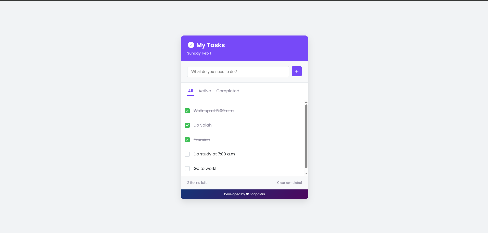
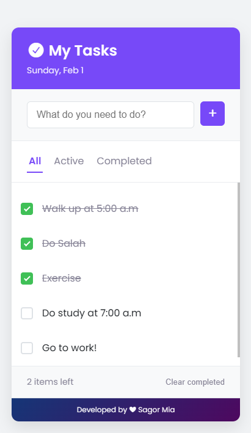

# Task Manager App

A minimal and functional **Task Manager / To-Do List App** built with **HTML,
CSS, and JavaScript**. Keep track of your tasks efficiently with a modern
interface and smooth interactions.

## Live Demo

[View the App on Netlify](https://minimal-task-manager.netlify.app/)

## Screenshots

**Desktop View**  

**Mobile View**  

## Features

- Add new tasks quickly
- Mark tasks as completed
- Delete tasks with smooth fade-out animation
- Filter tasks by **All**, **Active**, or **Completed**
- Clear all completed tasks
- Persistent storage using **localStorage**
- Responsive design for mobile and desktop
- **Dynamic date display** in the header (updates every day)

## Technologies Used

- **HTML5**
- **CSS3** (with custom variables & responsive design)
- **JavaScript** (DOM manipulation, localStorage, event handling)
- **Font Awesome** for icons

## Author

Developed with ❤ by **Sagor Mia**
